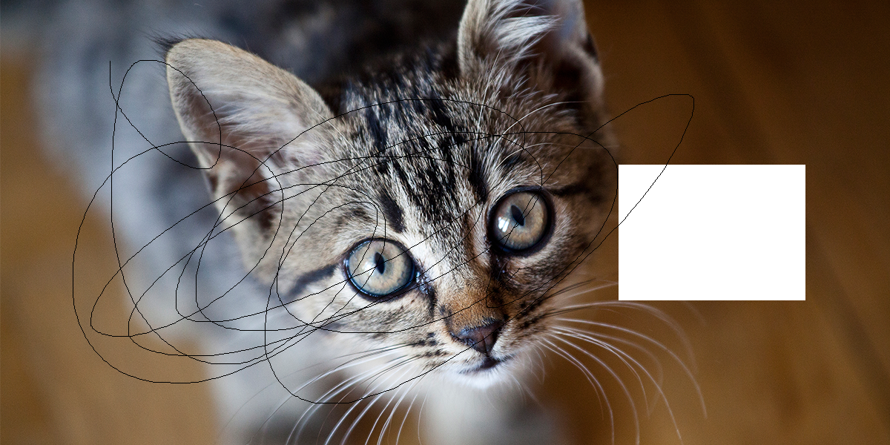
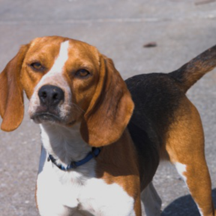
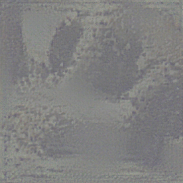
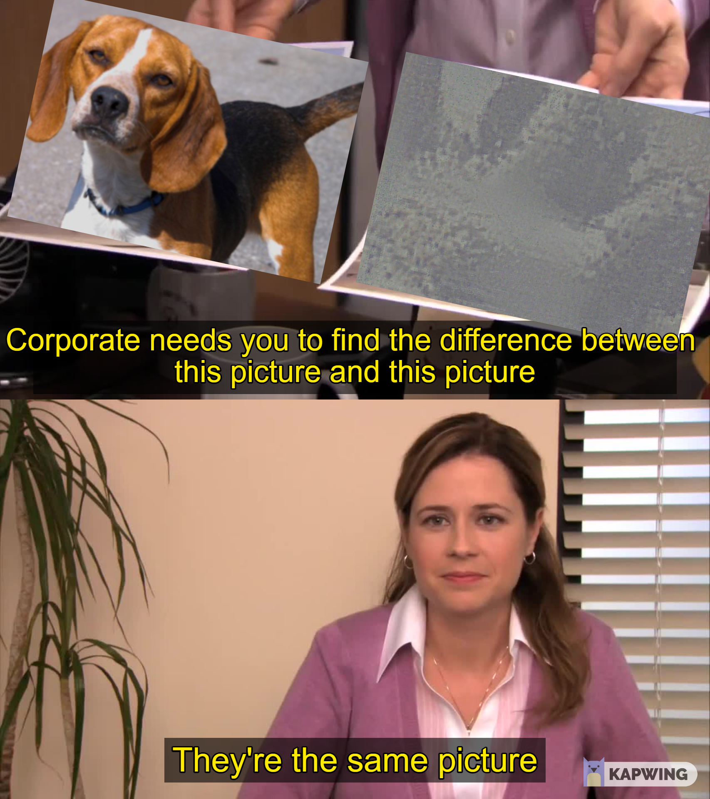

# AppleNeuralHash2ONNX

Forked from original repository [AppleNeuralHash2ONNX](https://github.com/AsuharietYgvar/AppleNeuralHash2ONNX).

# Docker running on WSL2 (Ubuntu 20.04.3 LTS)

To build this Docker image, run on the Docker host:

`docker build --build-arg IPSW_FILE=<filename>.ipsw -t neuralhash .`

To run the Docker image interactively run on the Docker host:

`docker run --privileged -ti --name neuralhash neuralhash /bin/bash`

Once you have logged into the Docker image, you must run the script.sh on the container to generate the ONNX model:

`./script.sh`

This generates the ONNX model file. Once the file has been generate, you can copy an image from the host to the
container by running this on the Docker host:

`docker cp <image_file> neuralhash:/workdir`

Once the file is in the container, run this command on the container:

`python3 nnhash.py ./neural_hash/model.onnx ./neural_hash/neuralhash_128x96_seed1.dat <image_file>`

This all worked fine on Ubuntu 20.04.3 LTS running on [WSL2](https://docs.microsoft.com/en-us/windows/wsl/install-win10)

The `iPhone13,4_14.7.1_18G82_Restore.ipsw` restore image was used for this testing.

## Usage

### Inspect model

[Netron](https://github.com/lutzroeder/netron) is a perfect tool for this purpose.

### Calculate neural hash with [onnxruntime](https://github.com/microsoft/onnxruntime)

1. Install required libraries:

```bash
pip install onnxruntime pillow
```

2. Run `nnhash.py` on an image:

```bash
python3 nnhash.py /path/to/model.onnx /path/to/neuralhash_128x96_seed1.dat image.jpg
```

Example output:

```
ab14febaa837b6c1484c35e6
```

**Note:** Neural hash generated here might be a few bits off from one generated on an iOS device. This is expected since
different iOS devices generate slightly different hashes anyway. The reason is that neural networks are based on
floating-point calculations. The accuracy is highly dependent on the hardware. For smaller networks it won't make any
difference. But NeuralHash has 200+ layers, resulting in significant cumulative errors.

|Device|Hash|
|---|---|
|iPad Pro 10.5-inch|`2b186faa6b36ffcc4c4635e1`|
|M1 Mac|`2b5c6faa6bb7bdcc4c4731a1`|
|iOS Simulator|`2b5c6faa6bb6bdcc4c4731a1`|
|ONNX Runtime|`2b5c6faa6bb6bdcc4c4735a1`|

## Results

For this picture of a cat


The NeuralHash generated was:

```
33c542c3204b10d946cec29e
```

Then editing the same photo, removing a section from it and drawing some random lines on it



The hash generated was:

```
32c543a32ed3fc59068cc0cb
```

Of which the hashes are quite similar at the beginning.
<br>

However, it's quite clear the ineffectiveness of Apple's perceptual hashing method on images. For example, this image of
a dog.



Produces the hash:

```
59a34eabe31910abfb06f308
```

And for this image



it produces the exact same hash!

```
59a34eabe31910abfb06f308
```

Yet for this classic windows background image


The hash produced is:

```
9f3bce9b9d716bf399cf4f21
```

And for the same image but slightly reduced with some imagine noise surrounding it


Which clearly identifies as the same image however the hash produced is completely different:

```
ff0dcf8b9371ebd28a4f5d2d
```

Oh and Apple's manual verification producedure?


<br>

This is some interesting work, thank you! Check out the interesting
discussion [here](https://github.com/AsuharietYgvar/AppleNeuralHash2ONNX/issues/1).

## Credits

- [@AsuharietYgvar](https://github.com/AsuharietYgvar/AppleNeuralHash2ONNX) for the original project for converting
  Apple NeuralHash model for CSAM Detection to ONNX.
- [@jeremytieman](https://github.com/jeremytieman) for the Dockerfile and Script.
- [nhcalc](https://github.com/KhaosT/nhcalc) for uncovering NeuralHash private API.
- [TNN](https://github.com/Tencent/TNN) for compiled Core ML to ONNX script.
